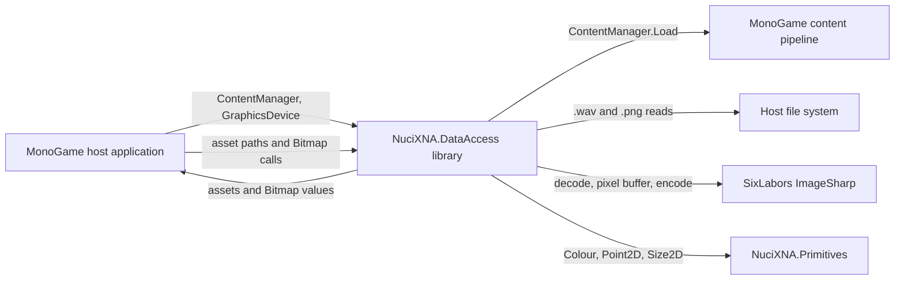
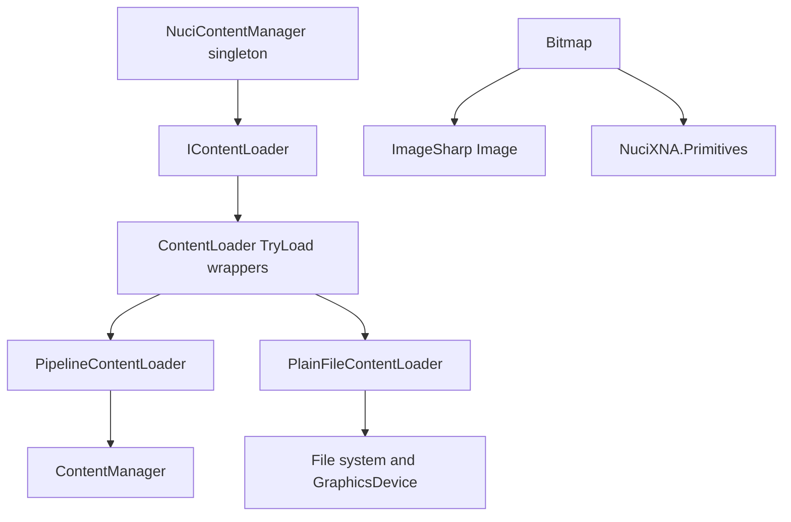
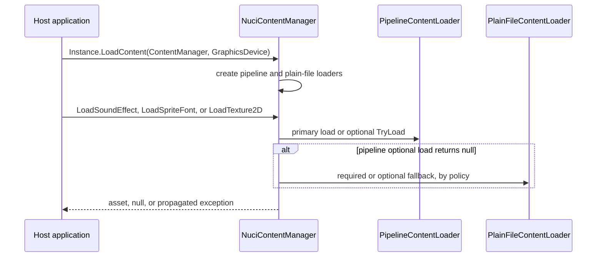
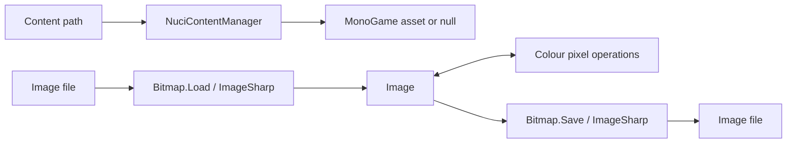
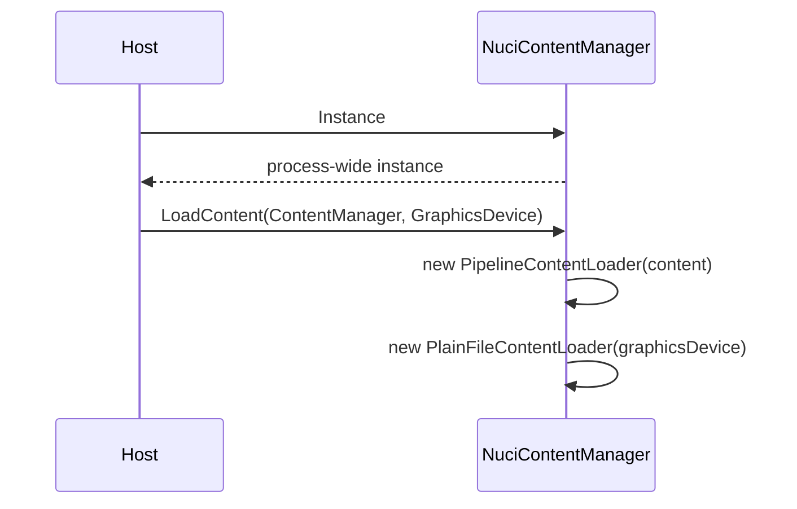
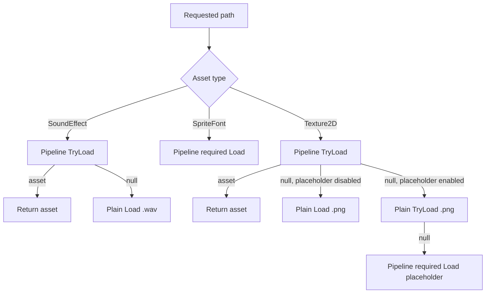
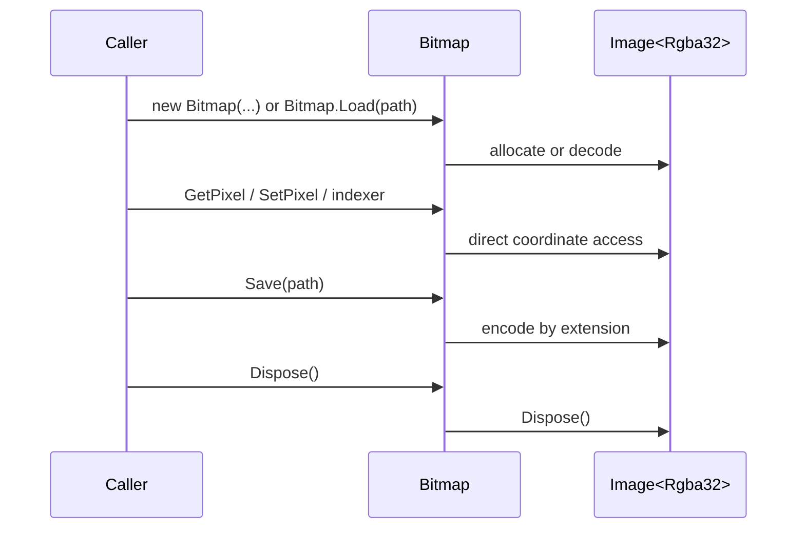
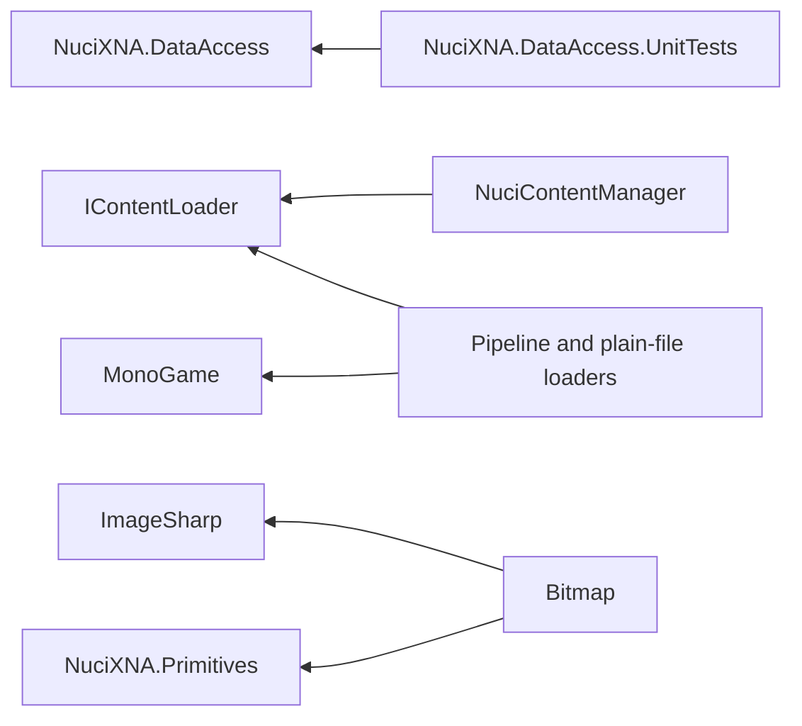

# NuciXNA.DataAccess Architecture

This document records the verified current architecture of the `NuciXNA.DataAccess` .NET library. It covers the library and its test project; applications that initialise MonoGame objects or consume the public API remain external to this repository.

## 📑 Table of Contents

- [Purpose](#purpose)
- [System Context](#system-context)
- [Architectural Style](#architectural-style)
- [Runtime Flow](#runtime-flow)
- [Components](#components)
- [Architectural Areas](#architectural-areas)
  - [Content Loading](#content-loading)
  - [Bitmap Access](#bitmap-access)
- [Data Architecture](#data-architecture)
- [Interfaces and Integrations](#interfaces-and-integrations)
- [Key Flows](#key-flows)
  - [Initialise Content Loading](#initialise-content-loading)
  - [Load an Asset](#load-an-asset)
  - [Manipulate a Bitmap](#manipulate-a-bitmap)
- [Content Resolution Policy](#content-resolution-policy)
- [Cross-Cutting Concerns](#cross-cutting-concerns)
  - [Error Handling](#error-handling)
  - [Configuration](#configuration)
  - [Concurrency and Resource Use](#concurrency-and-resource-use)
  - [Security and Privacy](#security-and-privacy)
  - [Observability](#observability)
- [Dependency Direction and Rules](#dependency-direction-and-rules)
- [External Dependencies](#external-dependencies)
- [Deployment and Operations](#deployment-and-operations)
- [Compatibility Contracts](#compatibility-contracts)
- [Testing and Verification](#testing-and-verification)
- [Design Constraints](#design-constraints)
- [Extension Points](#extension-points)
- [Architecture Decisions](#architecture-decisions)
- [Source Map](#source-map)
- [Related Documentation](#related-documentation)

## 🎯 Purpose

`NuciXNA.DataAccess` is a reusable .NET 10 library for two related concerns:
- It resolves MonoGame assets through compiled content-pipeline and raw-file loaders.
- It exposes mutable pixel access over ImageSharp images using `NuciXNA.Primitives` value types.

The principal audience is a game or graphics application that creates `ContentManager` and `GraphicsDevice` instances. The library does not own an application loop, a content root, game state, asset cache, persistence store, dependency-injection container, or process lifecycle.

## 🌐 System Context

A host application initialises the singleton content facade during its own content-loading phase and subsequently requests sound effects, sprite fonts, and textures. MonoGame provides pipeline assets and graphics/audio construction. The host file system provides optional `.wav` and `.png` fallbacks. Separately, callers use `Bitmap` to decode, edit, and encode image files through ImageSharp.



The principal external boundaries are:
- **MonoGame:** the host supplies live `ContentManager` and `GraphicsDevice` instances; MonoGame owns compiled-asset loading and graphics/audio object construction.
- **Host file system:** `PlainFileContentLoader` reads a path with an appended `.wav` or `.png` suffix; `Bitmap` accepts caller-selected read and write paths.
- **ImageSharp:** owns codec selection, image-memory allocation, coordinate validation, and disposal behaviour beneath `Bitmap`.
- **NuciXNA.Primitives:** provides the public colour and geometry representations at the bitmap boundary.

## 🏗️ Architectural Style

The implementation is a small library with an interface-and-adapter content boundary, a singleton orchestration facade, and an independent bitmap adapter. `IContentLoader` permits caller-supplied loaders, `ContentLoader` centralises optional-load semantics, and `NuciContentManager` selects a required or optional load path per asset type. `Bitmap` deliberately exposes a narrow façade over an `Image<Rgba32>`.



The principal architecture boundaries are:
- **Content contract:** `IContentLoader` defines required and optional loads for the three supported MonoGame asset types.
- **Content orchestration:** `NuciContentManager` determines loader ordering, placeholder policy, and which failures are propagated.
- **Bitmap adaptation:** `Bitmap` translates between ImageSharp's `Rgba32` and NuciXNA primitive types without applying additional image-processing policy.

## 🔄 Runtime Flow

The repository has no executable entry point. A consuming MonoGame application provides the runtime sequence by first calling `NuciContentManager.Instance.LoadContent` and then calling its load methods.



The principal runtime sequence is:
1. The host initialises the singleton with either standard MonoGame dependencies or two caller-supplied loaders.
2. The manager forwards the requested path through the asset-specific policy.
3. The selected loader returns an asset, returns `null` from an optional path, or permits a required-load exception to reach the caller.

## 🧩 Components

| Component | Responsibility | Principal Dependencies | Lifetime or Ownership |
|-----------|----------------|------------------------|-----------------------|
| [`IContentLoader`](NuciXNA.DataAccess/Content/IContentLoader.cs) | Public contract for required and optional asset loads. | MonoGame asset types. | Implemented by adapters or host-supplied loaders. |
| [`ContentLoader`](NuciXNA.DataAccess/Content/ContentLoader.cs) | Supplies `TryLoad*` wrappers around abstract required-load operations. | `System.Func<T>`. | Stateless abstract base. |
| [`PipelineContentLoader`](NuciXNA.DataAccess/Content/PipelineContentLoader.cs) | Loads compiled assets via `ContentManager.Load<T>`. | MonoGame `ContentManager`. | Owned by `NuciContentManager` after standard initialisation. |
| [`PlainFileContentLoader`](NuciXNA.DataAccess/Content/PlainFileContentLoader.cs) | Loads raw `.wav` and `.png` files. | `GraphicsDevice`, `SoundEffect`, `Texture2D`, file system. | Owned by `NuciContentManager` after standard initialisation. |
| [`NuciContentManager`](NuciXNA.DataAccess/Content/NuciContentManager.cs) | Global loader coordination and texture placeholder policy. | Two `IContentLoader` instances. | Lazily created static singleton; loader fields can be replaced by later `LoadContent` calls. |
| [`Bitmap`](NuciXNA.DataAccess/IO/Bitmap.cs) | Mutable RGBA pixel access and image load/save façade. | ImageSharp, `Colour`, `Point2D`, `Size2D`. | Per caller-created instance; caller invokes `Dispose`. |

## 🗂️ Architectural Areas

### Content Loading

Paths:
- [`NuciXNA.DataAccess/Content`](NuciXNA.DataAccess/Content)
- [`NuciXNA.DataAccess.UnitTests/Content`](NuciXNA.DataAccess.UnitTests/Content)

Responsibilities:
- Define a substitutable loading contract.
- Adapt MonoGame pipeline and raw-file mechanisms.
- Apply per-asset fallback and placeholder policy.

Boundary rules:
- A `TryLoad*` method is an optional-load boundary and returns `null` for any exception from its paired `Load*` method.
- `NuciContentManager` decides fallback ordering; individual loaders do not invoke each other.
- Fonts remain pipeline-only; raw-file font loading is unsupported.

### Bitmap Access

Paths:
- [`NuciXNA.DataAccess/IO`](NuciXNA.DataAccess/IO)
- [`NuciXNA.DataAccess.UnitTests/IO`](NuciXNA.DataAccess.UnitTests/IO)

Responsibilities:
- Own or wrap an ImageSharp `Image<Rgba32>`.
- Translate pixel and dimension data to NuciXNA primitives.
- Delegate codecs and output selection to ImageSharp.

Boundary rules:
- Coordinates are zero-based and are passed directly to ImageSharp.
- `Bitmap(Image<Rgba32>)` wraps the supplied image; it does not clone it.
- Disposing `Bitmap` disposes its wrapped `Image<Rgba32>`.

## 💾 Data Architecture

The library owns no durable application data. Content loader state consists only of references to two loaders in the singleton. `Bitmap` owns an in-memory ImageSharp buffer, or wraps a caller-supplied buffer, and `Save` serialises it to a caller-selected file path. No cache, transaction, migration, or retention mechanism exists.



| Data or Store | Owner | Representation and Storage | Lifecycle or Consistency |
|---------------|-------|----------------------------|--------------------------|
| Loader references | `NuciContentManager` | Two mutable `IContentLoader` fields in process memory. | Assigned by each `LoadContent` invocation; no synchronisation is applied to reassignment. |
| Placeholder path | `NuciContentManager` | Static mutable `string`. | Used per texture request; `null`, empty, and whitespace disable substitution. |
| Bitmap pixels | `Bitmap` / ImageSharp | In-memory `Image<Rgba32>`. | Mutable until disposal; direct coordinate operations have no copy or cache layer. |
| Encoded images | Caller-selected file system | Format inferred by ImageSharp from the output path. | Created or overwritten according to ImageSharp and file-system behaviour. |

## 🔌 Interfaces and Integrations

| Interface or Integration | Direction | Contract | Owner | Failure Semantics |
|--------------------------|-----------|----------|-------|-------------------|
| [`IContentLoader`](NuciXNA.DataAccess/Content/IContentLoader.cs) | Inbound | `Load*` may return an asset or throw; `TryLoad*` is documented as returning `null` when loading fails. | Host or library adapters. | `ContentLoader` implementations suppress all exceptions in `TryLoad*`; custom implementations control their own behaviour. |
| MonoGame `ContentManager` | Outbound | `Load<SoundEffect>`, `Load<SpriteFont>`, `Load<Texture2D>` with the supplied path. | `PipelineContentLoader`. | Required `Load*` exceptions propagate through the manager. |
| MonoGame raw stream APIs | Outbound | `SoundEffect.FromStream` for `path + ".wav"`; `Texture2D.FromStream` for `path + ".png"`. | `PlainFileContentLoader`. | Required calls propagate file or decode errors; optional wrappers convert them to `null`. |
| ImageSharp | Outbound | `Image.Load<Rgba32>`, indexed `Rgba32` access, and `Image.Save`. | `Bitmap`. | Exceptions are not caught by `Bitmap`; callers receive ImageSharp and file-system failures. |

## 🔀 Key Flows

### Initialise Content Loading



The standard overload creates both adapters. The injection overload instead retains the exact `IContentLoader` instances supplied by the host, which supports substitutes and tests. The manager performs no validation and exposes no reset or disposal operation; invoking load methods before initialisation dereferences unset fields and fails.

### Load an Asset



All branches forward the original path without normalisation. Sound and placeholder-disabled texture fallbacks are required loads, so failure is observable to the caller. Placeholder-enabled texture fallback is optional until the configured placeholder itself is required from the pipeline.

### Manipulate a Bitmap



`GetPixel` constructs `Colour` with ImageSharp alpha, red, green, and blue channels in ARGB argument order. `SetPixel` constructs `Rgba32` with `Colour` red, green, blue, and alpha channels. Indexers and `Point2D` overloads delegate to the integer-coordinate methods.

## ⚙️ Content Resolution Policy

| Requested type | First attempt | Second attempt | Final behaviour |
|----------------|---------------|----------------|-----------------|
| `SoundEffect` | Pipeline `TryLoadSoundEffect(path)` | Plain-file required `LoadSoundEffect(path)` | Returns the first asset, otherwise propagates the plain-file failure. |
| `SpriteFont` | Pipeline required `LoadSpriteFont(path)` | None | Returns the pipeline asset or propagates the failure. |
| `Texture2D`, placeholder absent | Pipeline `TryLoadTexture2D(path)` | Plain-file required `LoadTexture2D(path)` | Returns the first asset, `null` if a custom required loader returns `null`, or propagates fallback failure. |
| `Texture2D`, placeholder present | Pipeline `TryLoadTexture2D(path)` | Plain-file `TryLoadTexture2D(path)`, then pipeline required `LoadTexture2D(placeholder)` | Returns the requested asset, the configured placeholder, `null` if the placeholder loader returns `null`, or propagates placeholder failure. |

`PlainFileContentLoader.LoadSpriteFont` throws `NotImplementedException` by design. It is not selected by the manager for fonts.

## 🧵 Cross-Cutting Concerns

### Error Handling

`ContentLoader.TryLoad<T>` catches every exception and returns `null`, including `OutOfMemoryException` and `NullReferenceException`; this is observable, tested behaviour rather than filtered missing-file handling. In contrast, `Load*` calls are required-load boundaries and do not catch errors. `NuciContentManager` combines the two semantics to make fallback decisions. `Bitmap` introduces no error translation.

### Configuration

| Configuration Area | Source | Responsibility | Override or Secret Policy |
|--------------------|--------|----------------|---------------------------|
| Missing texture placeholder | `NuciContentManager.MissingTexturePlaceholder` static property | Selects a pipeline texture when both optional requested-texture attempts return `null`. | Process-wide mutable value; no configuration file, environment variable, secret, or precedence model exists. |
| Content loaders | `LoadContent` method arguments | Selects standard MonoGame adapters or host-defined implementations. | The last call replaces the retained references; no validation or immutability policy exists. |

### Concurrency and Resource Use

`Instance` uses `volatile` plus `Lock` double-checked initialisation to construct one manager instance. This protection does not make `LoadContent`, `MissingTexturePlaceholder`, underlying loaders, or `Bitmap` operations thread-safe. Asset and image object lifetime is delegated to MonoGame or ImageSharp; this library does not dispose loaders or assets. `PlainFileContentLoader` passes a freshly opened `FileStream` into MonoGame factory methods without a local `using`; stream ownership is therefore determined by those external APIs.

### Security and Privacy

The library accepts host-controlled paths and performs no path validation, access control, sandboxing, or secret handling. Callers determine trust boundaries and must not pass untrusted paths without appropriate host-side policy. The library contains no telemetry, user-data collection, credential processing, or network integration.

### Observability

No logging, metrics, tracing, health endpoint, or diagnostic event is implemented. Optional failures collapse to `null` inside `ContentLoader.TryLoad<T>`, so a host cannot distinguish missing input from another exception through this API alone.

## 🧭 Dependency Direction and Rules

Production code depends outward on MonoGame, NuciXNA.Primitives, and ImageSharp. The content manager depends only on `IContentLoader`, while concrete loaders depend on the corresponding external APIs. Tests depend on production code and test-only frameworks; production code does not reference the test project.



The principal dependency rules are:
- `NuciContentManager` coordinates only `IContentLoader` methods and must not acquire direct file-system or `ContentManager` dependencies outside its standard composition overload.
- Concrete content loaders must preserve the distinction between required `Load*` and optional `TryLoad*` operations.
- `Bitmap` must preserve `Colour` to `Rgba32` channel ordering and its disposal boundary.
- The test project may mock public contracts; no test helper is present in production code.

## 📦 External Dependencies

| Dependency | Responsibility | Integration Boundary | Architectural Consequence |
|------------|----------------|----------------------|---------------------------|
| `MonoGame.Framework.DesktopGL` 3.8.4 | XNA/MonoGame asset, content, audio, and graphics types. | Content namespace. | Consumers must provide compatible live MonoGame objects for standard content initialisation. |
| `NuciXNA.Primitives` 2.1.7 | `Colour`, `Point2D`, and `Size2D`. | `Bitmap` public API. | Bitmap API compatibility includes these external value types. |
| `SixLabors.ImageSharp` 3.1.6 | Image decoding, encoding, buffer representation, and pixel type. | `Bitmap`. | Codec and resource semantics are delegated to ImageSharp. Restore currently reports known high- and moderate-severity vulnerabilities for this pinned version. |
| NUnit, Moq, Microsoft.NET.Test.Sdk, NUnit3TestAdapter | Unit-test discovery, assertions, and mocking. | Test project only. | They do not ship as library dependencies. |

## 🚀 Deployment and Operations

The distributable unit is the [`NuciXNA.DataAccess`](NuciXNA.DataAccess/NuciXNA.DataAccess.csproj) NuGet library targeting `net10.0`; there is no service, executable, container, database, or deployment topology in this repository. The solution builds Debug and Release configurations for Any CPU. The tracked GitHub Actions workflow runs on `ubuntu-latest` for pushes and pull requests to `master`, restores/builds/tests with .NET 10, and installs Microsoft core fonts before validation.

| Concern | Current Design | Architectural Consequence |
|---------|----------------|---------------------------|
| Runtime host | Library loaded by a MonoGame application. | Host owns startup, shutdown, graphics-device lifetime, and content root. |
| Persistent state | None. | Recovery, scaling, and backup are out of scope. |
| CI | [`.github/workflows/dotnet.yml`](.github/workflows/dotnet.yml). | CI requires package availability, .NET 10, and apt font installation capability. |
| Package risk | Pinned ImageSharp 3.1.6 dependency produces restore vulnerability warnings. | Dependency maintenance is an operational and security responsibility. |

## 🛡️ Compatibility Contracts

| Contract | Owner | Invariant | Verification | Change Policy |
|----------|-------|-----------|--------------|---------------|
| `IContentLoader` | Content package API. | Six methods and required-versus-optional semantics remain usable by host loaders. | [`ContentLoaderTests`](NuciXNA.DataAccess.UnitTests/Content/ContentLoaderTests.cs). | Treat signature or exception-semantics changes as consumer-impacting. |
| Content fallback order | `NuciContentManager`. | Pipeline precedes plain file; font remains pipeline-only; placeholder changes texture fallback order. | [`NuciContentManagerTests`](NuciXNA.DataAccess.UnitTests/Content/NuciContentManagerTests.cs). | Preserve unless a deliberate behaviour change includes revised tests and documentation. |
| Plain-file conventions | `PlainFileContentLoader`. | Raw sounds append `.wav`; raw textures append `.png`; fonts are unsupported. | No direct adapter test. | Preserve path and suffix conventions for host assets. |
| Bitmap channel and disposal semantics | `Bitmap`. | `Colour` ARGB values round-trip through `Rgba32`; `Dispose` disposes the backing image. | [`BitmapTests`](NuciXNA.DataAccess.UnitTests/IO/BitmapTests.cs). | Preserve to avoid visual or resource-lifetime regressions. |

## ✅ Testing and Verification

[`NuciXNA.DataAccess.UnitTests`](NuciXNA.DataAccess.UnitTests/NuciXNA.DataAccess.UnitTests.csproj) contains 256 discovered NUnit cases. [`ContentLoaderTests`](NuciXNA.DataAccess.UnitTests/Content/ContentLoaderTests.cs) verifies null and broad-exception conversion plus path forwarding. [`NuciContentManagerTests`](NuciXNA.DataAccess.UnitTests/Content/NuciContentManagerTests.cs) verifies mocked loader selection, propagation, and texture placeholder branches. [`BitmapTests`](NuciXNA.DataAccess.UnitTests/IO/BitmapTests.cs) verifies construction dimensions, pixel round trips, indexer equivalence, and disposal without exception.

Execute the principal automated verification with:

```bash
dotnet test NuciXNA.DataAccess.sln
```

Coverage gaps relevant to architecture:
- No direct tests instantiate `PipelineContentLoader` or `PlainFileContentLoader` against MonoGame/file-system resources.
- No tests cover `Bitmap.Load`, `Bitmap.Save`, invalid dimensions, invalid coordinates, codec failure, or post-disposal access.
- No test verifies manager behaviour before `LoadContent`, concurrent initialisation/reconfiguration, standard MonoGame composition, singleton identity, or placeholder-state isolation across threads.
- No tests assert ownership behaviour for a wrapped ImageSharp image after `Bitmap.Dispose`.

## ⚠️ Design Constraints

- **Initialisation order:** `NuciContentManager` requires `LoadContent` before every load call; no guard or descriptive initialisation exception exists.
- **Global mutable state:** Singleton loader references and placeholder configuration are process-wide and mutable.
- **Broad exception suppression:** Optional loader calls cannot preserve failure diagnostics and may suppress non-recoverable exceptions.
- **Format scope:** Raw fallback supports only `.wav` sounds and `.png` textures; `SpriteFont` is pipeline-only.
- **Host affinity:** The standard content flow requires MonoGame desktop dependencies and a graphics device for raw textures.
- **No asset cache policy:** Cache and disposal behaviour reside in MonoGame, custom loaders, or the host.
- **Dependency exposure:** ImageSharp 3.1.6 restore currently reports known vulnerabilities; no mitigation is implemented in this repository state.

## 🔧 Extension Points

### Custom Content Loaders

1. Implement all six members of [`IContentLoader`](NuciXNA.DataAccess/Content/IContentLoader.cs), or derive from [`ContentLoader`](NuciXNA.DataAccess/Content/ContentLoader.cs) and implement its three required loads.
2. Supply the implementation pair through `NuciContentManager.Instance.LoadContent`.
3. Add tests that establish required and optional failure semantics, path forwarding, and manager ordering.

A custom `IContentLoader` controls its own `TryLoad*` behaviour. Deriving from `ContentLoader` opts into the library's catch-all conversion to `null`.

### Bitmap Construction

Callers can construct `Bitmap` from dimensions, `Size2D`, or an existing ImageSharp `Image<Rgba32>`. Wrapped-image callers must treat `Bitmap.Dispose` as disposing that image, and must preserve ImageSharp's coordinate, codec, and memory contracts.

## 📝 Architecture Decisions

| Decision | Rationale | Consequence | Record |
|----------|-----------|-------------|--------|
| Use a loader interface with a base optional-load wrapper. | Host code and tests can substitute asset sources while common optional-load behaviour is centralised. | Required and optional operations have materially different exception semantics. | Documented here and in [`ContentLoader`](NuciXNA.DataAccess/Content/ContentLoader.cs). |
| Prefer compiled pipeline assets, with raw-file fallback for sounds and textures. | The manager explicitly tries the pipeline first and the plain-file adapter supports those two formats. | Asset availability and failure behaviour depend on type and placeholder configuration. | Documented here and in [`NuciContentManager`](NuciXNA.DataAccess/Content/NuciContentManager.cs). |
| Use a global content facade. | `NuciContentManager.Instance` is the sole construction path. | Initialisation/reconfiguration is process-wide. | Documented here and in [`NuciContentManager`](NuciXNA.DataAccess/Content/NuciContentManager.cs). |
| Delegate image mechanics to ImageSharp. | `Bitmap` wraps `Image<Rgba32>` and forwards loading, saving, storage, and disposal. | Codec, bounds, and resource behaviours inherit from ImageSharp. | Documented here and in [`Bitmap`](NuciXNA.DataAccess/IO/Bitmap.cs). |

## 🗺️ Source Map

| Area | Location | Role |
|------|----------|------|
| Library project | [`NuciXNA.DataAccess`](NuciXNA.DataAccess) | Package metadata and production source. |
| Content public contract | [`NuciXNA.DataAccess/Content/IContentLoader.cs`](NuciXNA.DataAccess/Content/IContentLoader.cs) | Loader API surface. |
| Content policy | [`NuciXNA.DataAccess/Content/NuciContentManager.cs`](NuciXNA.DataAccess/Content/NuciContentManager.cs) | Singleton, composition, fallback, placeholder selection. |
| Content adapters | [`NuciXNA.DataAccess/Content`](NuciXNA.DataAccess/Content) | Base, MonoGame pipeline, and plain-file implementations. |
| Bitmap façade | [`NuciXNA.DataAccess/IO/Bitmap.cs`](NuciXNA.DataAccess/IO/Bitmap.cs) | ImageSharp adaptation and pixel API. |
| Test project | [`NuciXNA.DataAccess.UnitTests`](NuciXNA.DataAccess.UnitTests) | NUnit unit tests and package references. |
| Detailed traceability | [`docs/TRACEABILITY.md`](docs/TRACEABILITY.md) | Feature-to-code and test-to-behaviour map. |
| CI | [`.github/workflows/dotnet.yml`](.github/workflows/dotnet.yml) | GitHub Actions restore, build, and test workflow. |

## 📚 Related Documentation

- [`README.md`](README.md) provides installation, usage, supported formats, and contributor commands.
- [`docs/TRACEABILITY.md`](docs/TRACEABILITY.md) maps each material feature and test suite to implementation and known gaps.
- [`LICENSE`](LICENSE) records the GPL-3.0-or-later licence.
